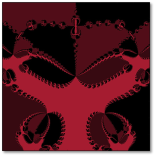
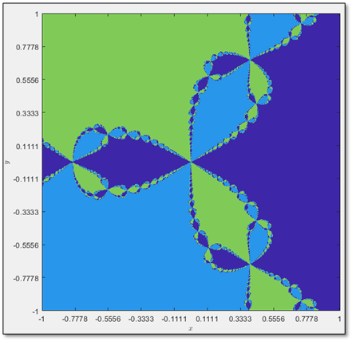
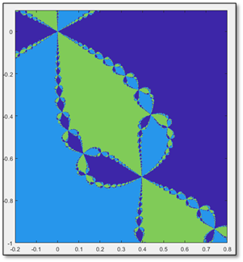
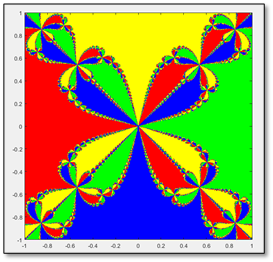
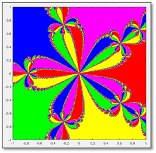
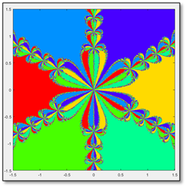
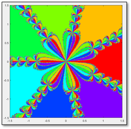
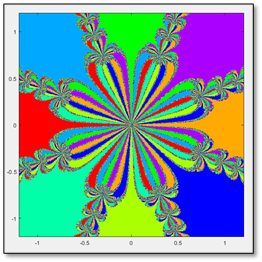
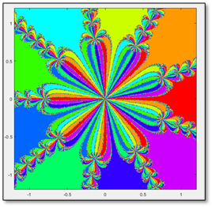
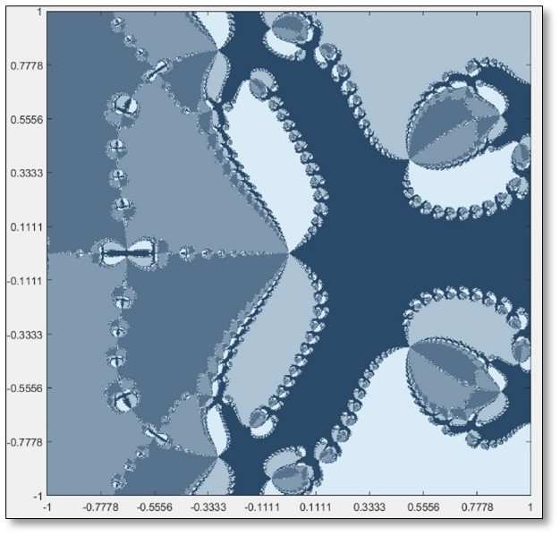

# Newton Fractals in MATLAB
This is an implementation of Newton Fractals written in MATLAB. You can [read the article](https://github.com/betoml00/newton-fractals/blob/main/FractalesMateCompu.pdf) we wrote about them and see some images of the results:

